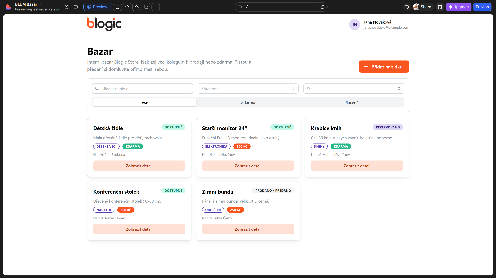
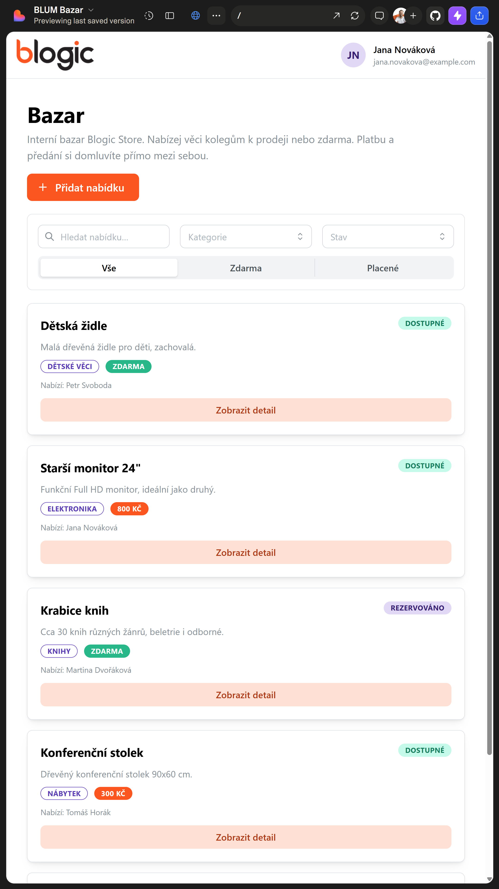
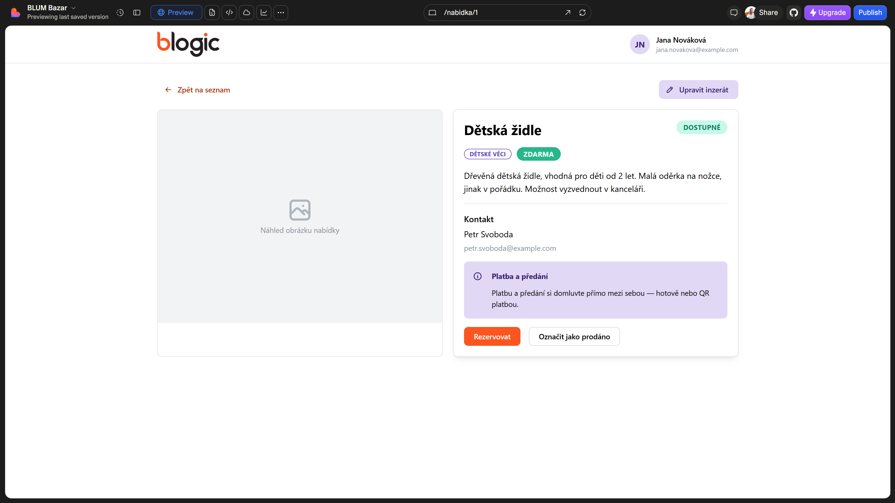
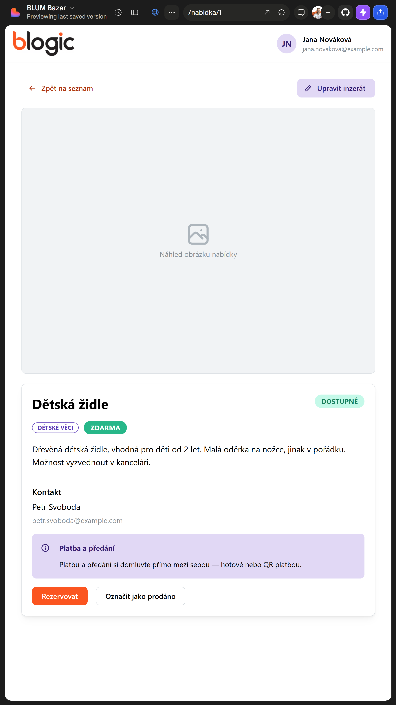
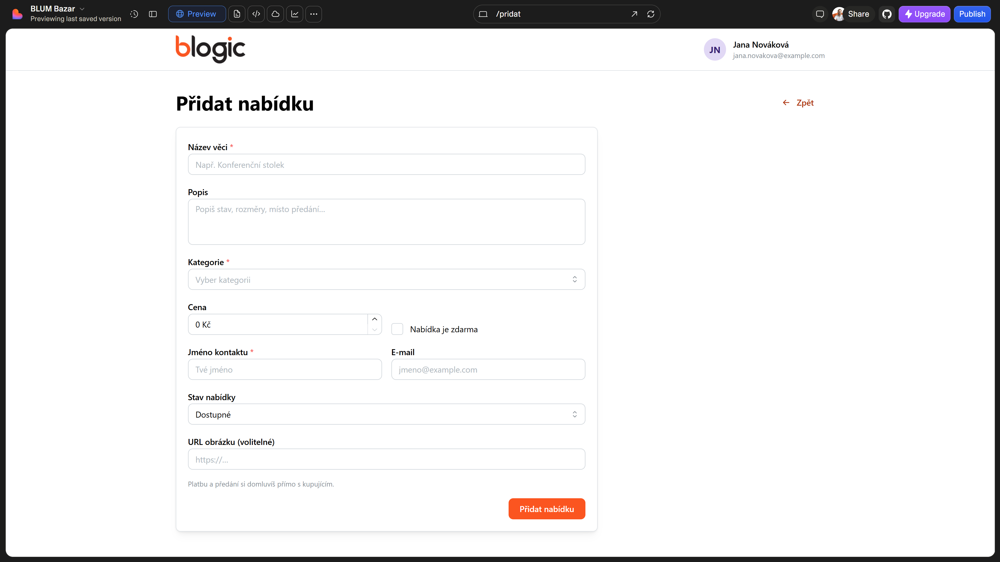
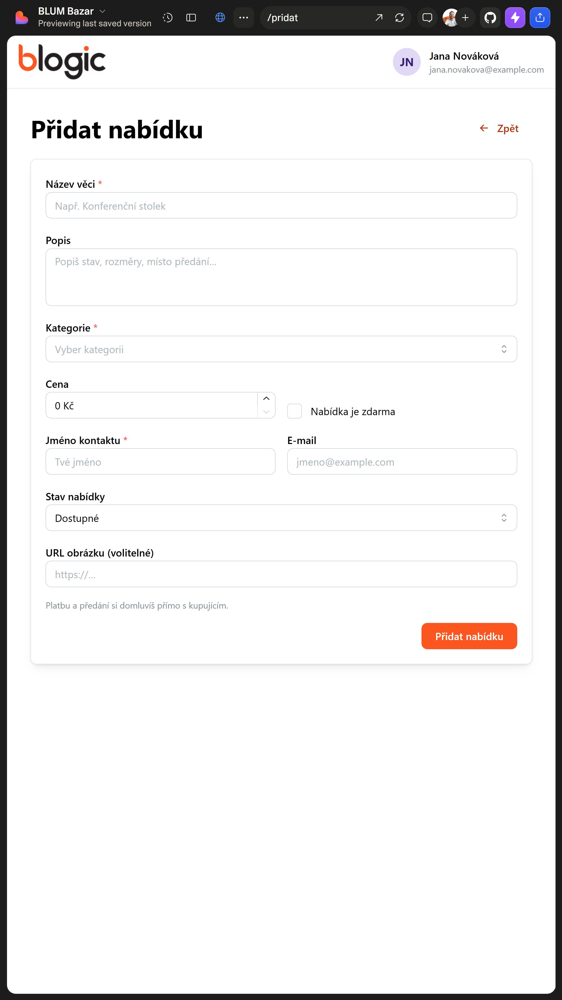

# Zadání praxe: Blogic Store Bazar

Tento dokument popisuje, co budete během dvoutýdenní praxe vytvářet.

Pracujete s připraveným projektem **Blum Next App Template**. Příprava prostředí, spuštění projektu, struktura složek (včetně `[locale]`), lokalizace textů a práce s Gitem jsou popsané v samostatném dokumentu [`README.md`](README.md). Než začnete pracovat na zadání, projděte ho.

---

## 1. Kontext projektu

Cílem praxe je vytvořit jednoduchou webovou aplikaci **Bazar** v rámci Blogic Store.

Aplikace bude sloužit jako interní bazar pro spolupracovníky. Uživatelé budou moci nabídnout věci k prodeji nebo k přenechání zdarma.

Příklady věcí:

- nábytek,
- dětské věci,
- oblečení,
- elektronika,
- knihy,
- ostatní věci z domácnosti.

Aplikace nebude řešit samotnou platbu. Uživatelé si platbu nebo předání domluví mezi sebou, například hotově nebo pomocí QR platby.

---

## 2. Cíl praxe

Cílem není vytvořit dokonalou produkční aplikaci.

Cílem je vyzkoušet si základní postup při vývoji webové aplikace:

- porozumět zadání,
- rozdělit práci na menší části,
- vytvořit jednoduché obrazovky,
- použít hotové komponenty,
- pracovat s jednoduchými daty,
- vytvořit formulář,
- průběžně ukládat změny,
- na konci umět vysvětlit vlastní řešení.

Praxe má sloužit také jako motivace pro další studium softwarového inženýrství, vývoje aplikací nebo jiných IT oborů.

---

## 3. Technické zaměření

Aplikace je postavená jako webová aplikace v Next.js / React.

Pro uživatelské rozhraní používejte **Mantine UI**.

Oficiální dokumentace a inspirace:

- Mantine Core: <https://mantine.dev/core/package/>
- Mantine Forms: <https://mantine.dev/form/use-form/>
- Mantine UI šablony: <https://ui.mantine.dev/>
- Next.js App Router: <https://nextjs.org/docs/app>
- Next.js struktura projektu: <https://nextjs.org/docs/app/getting-started/project-structure>
- Next.js dynamické adresy: <https://nextjs.org/docs/app/api-reference/file-conventions/dynamic-routes>

Doporučení:

- používejte hlavně existující Mantine komponenty,
- inspirujte se hotovými bloky z Mantine UI,
- nepřidávejte zbytečně vlastní složitý design,
- nepřepisujte celý projekt,
- postupujte po malých krocích.

### Referenční návrhy obrazovek

Referenční návrhy obrazovek jsou vložené přímo u povinných úloh, kterých se týkají. Slouží jako inspirace pro rozložení stránky, hlavní prvky a způsob ovládání. Není nutné je kopírovat přesně pixel po pixelu. Důležité je zachovat hlavní prvky obrazovky a použít komponenty z Mantine UI.

Obrázky použité pouze v dokumentaci neumisťujte do složky `public`. Složka `public` je určená pro statické soubory samotné aplikace. Referenční obrazovky uložte do složky `docs/assets/screens/`.

---

## 4. Práce s daty

Projekt má **připravenou lokální databázi** (SQLite + Drizzle ORM ve složce `src/db/`). Doporučená varianta je tuto databázi použít:

- schéma tabulek najdete v `src/db/schemas/`,
- migrace spustíte přes `npm run db:migrate`,
- obsah si můžete prohlédnout přes `npm run db:studio` (viz README, sekce 9).

Pro splnění základního zadání není nutné navrhovat vlastní novou databázi — stačí přidat tabulku pro inzeráty do existujícího schématu.

Pokud se vám práce s databází zdá příliš složitá, můžete po domluvě s mentorem zvolit jednodušší variantu:

- ukázková data přímo v aplikaci (např. v poli konstant),
- jednoduché uložení ve stavu aplikace,
- `localStorage`.

Důležité je, aby aplikace uměla zobrazit data a pracovat s nimi v rámci základního scénáře.

---

## 5. Povinná část

Povinná část je minimum, které by měla aplikace na konci praxe zvládnout.

---

### 5.1 Přehled inzerátů

Vytvořte stránku, která zobrazí seznam bazarových inzerátů.

Každý inzerát v přehledu zobrazí:

- název věci,
- krátký popis,
- cenu nebo informaci **Zdarma**,
- kategorii,
- stav inzerátu.

Cílem je, aby uživatel rychle poznal, jaké věci jsou v bazaru dostupné.

Referenční návrh obrazovky:





Doporučené Mantine komponenty:

- `Card`,
- `Badge`,
- `Button`,
- `SimpleGrid` nebo `Grid`,
- `Group`,
- `Stack`,
- `Text`,
- `Title`.

Kde hledat inspiraci:

- Mantine Card: <https://mantine.dev/core/card/>
- Mantine Badge: <https://mantine.dev/core/badge/>
- Mantine Button: <https://mantine.dev/core/button/>
- Mantine SimpleGrid: <https://mantine.dev/core/simple-grid/>
- Mantine UI šablony: <https://ui.mantine.dev/>

---

### 5.2 Detail inzerátu

Po kliknutí na inzerát se zobrazí jeho detail.

Detail zobrazí:

- název věci,
- delší popis,
- cenu nebo informaci **Zdarma**,
- kategorii,
- kontakt na nabízejícího,
- stav inzerátu.

Cílem je, aby zájemce získal všechny důležité informace na jednom místě.

Referenční návrh obrazovky:





Doporučení:

- detail může být samostatná stránka,
- pro detail podle ID se hodí dynamická adresa,
- stránka by měla obsahovat tlačítko pro návrat na přehled.

Kde hledat inspiraci:

- Next.js Dynamic Routes: <https://nextjs.org/docs/app/api-reference/file-conventions/dynamic-routes>
- Mantine Card: <https://mantine.dev/core/card/>
- Mantine Divider: <https://mantine.dev/core/divider/>
- Mantine Alert: <https://mantine.dev/core/alert/>

---

### 5.3 Vytvoření nového inzerátu

Vytvořte formulář pro přidání nového inzerátu.

Formulář bude obsahovat:

- název věci,
- popis,
- cenu,
- možnost označit nabídku jako **Zdarma**,
- kategorii,
- kontakt na nabízejícího.

Po odeslání formuláře se nový inzerát zobrazí v přehledu.

Referenční návrh obrazovky:





Doporučené Mantine komponenty:

- `TextInput`,
- `Textarea`,
- `NumberInput`,
- `Select`,
- `Checkbox`,
- `Button`,
- `Card`,
- `Stack`,
- `Group`.

Doporučená jednoduchá validace:

- název je povinný,
- popis je povinný,
- kategorie je povinná,
- kontakt je povinný,
- cena je povinná pouze tehdy, když nabídka není zdarma.

Kde hledat inspiraci:

- Mantine TextInput: <https://mantine.dev/core/text-input/>
- Mantine Textarea: <https://mantine.dev/core/textarea/>
- Mantine NumberInput: <https://mantine.dev/core/number-input/>
- Mantine Select: <https://mantine.dev/core/select/>
- Mantine Checkbox: <https://mantine.dev/core/checkbox/>
- Mantine useForm: <https://mantine.dev/form/use-form/>

---

### 5.4 Kategorie a stav inzerátu

Každý inzerát musí mít kategorii a stav.

Doporučené kategorie:

- Nábytek,
- Dětské věci,
- Oblečení,
- Elektronika,
- Knihy,
- Ostatní.

Doporučené stavy:

- Dostupné,
- Rezervováno,
- Prodáno / předáno.

Kategorie a stav musí být viditelné:

- v přehledu inzerátů,
- v detailu inzerátu.

U inzerátu musí být možné změnit stav.

Změnu stavu můžete řešit jednoduše, například:

- tlačítkem,
- výběrem ze seznamu,
- samostatnou akcí v detailu inzerátu.

Doporučené Mantine komponenty:

- `Select`,
- `Badge`,
- `Button`,
- `SegmentedControl`.

Kde hledat inspiraci:

- Mantine Select: <https://mantine.dev/core/select/>
- Mantine Badge: <https://mantine.dev/core/badge/>
- Mantine SegmentedControl: <https://mantine.dev/core/segmented-control/>

---

## 6. Volitelná rozšíření

Volitelná rozšíření jsou určena pro studenty, kteří dokončí povinnou část dříve nebo si chtějí vyzkoušet něco navíc.

Není nutné splnit všechna volitelná rozšíření.

Doporučené pořadí je od jednodušších po náročnější.

---

### 6.1 Vyhledávání

Přidejte vyhledávací pole, které umožní hledat inzeráty podle názvu nebo popisu.

Doporučené Mantine komponenty:

- `TextInput`,
- případně ikona hledání, pokud už je v projektu používaná ikonová knihovna.

Kde hledat inspiraci:

- Mantine TextInput: <https://mantine.dev/core/text-input/>

---

### 6.2 Filtrování inzerátů

Přidejte možnost filtrovat inzeráty podle:

- kategorie,
- stavu,
- toho, zda je nabídka zdarma.

Doporučené Mantine komponenty:

- `Select`,
- `SegmentedControl`,
- `Checkbox`,
- `Group`.

Kde hledat inspiraci:

- Mantine Select: <https://mantine.dev/core/select/>
- Mantine SegmentedControl: <https://mantine.dev/core/segmented-control/>
- Mantine Checkbox: <https://mantine.dev/core/checkbox/>

---

### 6.3 Úprava inzerátu

Přidejte možnost upravit existující inzerát.

Formulář pro úpravu může být podobný formuláři pro vytvoření inzerátu, ale bude předvyplněný aktuálními hodnotami.

Uživatel by měl být schopen:

- otevřít detail inzerátu,
- přejít na úpravu,
- změnit údaje,
- uložit změny,
- vidět aktualizovaná data.

Doporučené Mantine komponenty:

- stejné komponenty jako u vytvoření inzerátu,
- `Button`,
- `Alert` pro potvrzení změny.

Kde hledat inspiraci:

- Mantine useForm: <https://mantine.dev/form/use-form/>
- Mantine Alert: <https://mantine.dev/core/alert/>
- Next.js Dynamic Routes: <https://nextjs.org/docs/app/api-reference/file-conventions/dynamic-routes>

---

### 6.4 Smazání inzerátu

Přidejte možnost smazat inzerát.

Před smazáním zobrazte potvrzení, aby uživatel inzerát nesmazal omylem.

Doporučené Mantine komponenty:

- `Button`,
- `Modal`,
- `Alert`.

Kde hledat inspiraci:

- Mantine Modal: <https://mantine.dev/core/modal/>
- Mantine Alert: <https://mantine.dev/core/alert/>

---

### 6.5 Obrázek inzerátu

Umožněte k inzerátu přidat obrázek.

Jednodušší varianta:

- použít připravený ilustrační obrázek,
- nebo zadat URL obrázku.

Pokročilejší varianta:

- umožnit nahrání obrázku z počítače.

Pro základní splnění stačí vizuálně zobrazit obrázek nebo jeho placeholder.

Kde hledat inspiraci:

- Mantine Image: <https://mantine.dev/core/image/>
- Next.js Image: <https://nextjs.org/docs/app/api-reference/components/image>

---

### 6.6 QR platba

U placeného inzerátu zobrazte místo pro QR platbu.

Aplikace nemusí skutečně zpracovávat platbu.

Stačí například:

- zobrazit ukázkový QR kód,
- připravit místo, kde by QR kód mohl být,
- zobrazit informaci, že platbu si uživatelé řeší mezi sebou.

Doporučené Mantine komponenty:

- `Card`,
- `Alert`,
- `Image`.

---

### 6.7 Přihlášení přes Google

Toto je pokročilé volitelné rozšíření.

Přidejte přihlášení přes Google Identity Provider.

Protože se jedná o Next.js aplikaci, můžete využít například **Better Auth** a vytvořit OAuth klienta v Google Dashboard.

Po přihlášení může aplikace například:

- zobrazovat jméno přihlášeného uživatele,
- zobrazit user badge v hlavičce,
- automaticky předvyplnit kontakt u nového inzerátu,
- umožnit úpravu pouze vlastních inzerátů,
- skrýt formulář pro nepřihlášené uživatele.

Toto rozšíření není povinné. Vyžaduje pečlivější práci s nastavením a proměnnými prostředí.

Kde hledat inspiraci:

- Better Auth Next.js integration: <https://better-auth.com/docs/integrations/next>
- Better Auth Google: <https://www.better-auth.com/docs/authentication/google>
- Google OAuth for Web Server Apps: <https://developers.google.com/identity/protocols/oauth2/web-server>

---

## 7. Doporučený postup práce

Tento plán je orientační. Mentor ho může upravit podle průběhu praxe.

---

### Den 1: Prostředí a orientace

Cíl dne:

- připravit vývojové prostředí,
- spustit projekt lokálně,
- otevřít projekt ve Visual Studio Code,
- najít hlavní stránku,
- provést první malou změnu,
- uložit změnu pomocí Gitu.

Doporučená dokumentace:

- VS Code pro Windows: <https://code.visualstudio.com/docs/setup/windows>
- Git setup: <https://docs.github.com/en/get-started/git-basics/set-up-git>
- Node.js download: <https://nodejs.org/en/download>
- Next.js Project Structure: <https://nextjs.org/docs/app/getting-started/project-structure>

Kontrolní bod:

- aplikace běží v prohlížeči,
- student ví, kde najít stránky,
- student má první commit.

---

### Dny 2–3: Data a přehled inzerátů

Cíl:

- připravit několik ukázkových inzerátů,
- zobrazit seznam inzerátů,
- použít Mantine komponenty pro základní rozvržení.

Příklad ukázkových inzerátů:

- Dětská židle,
- Starší monitor,
- Krabice knih,
- Konferenční stolek,
- Zimní bunda.

Doporučená dokumentace:

- Mantine Card: <https://mantine.dev/core/card/>
- Mantine Badge: <https://mantine.dev/core/badge/>
- Mantine Button: <https://mantine.dev/core/button/>
- Mantine SimpleGrid: <https://mantine.dev/core/simple-grid/>
- Mantine UI šablony: <https://ui.mantine.dev/>

Kontrolní bod:

- aplikace zobrazí seznam inzerátů,
- každý inzerát má název, popis, cenu, kategorii a stav,
- stránka je čitelná a přehledná.

---

### Dny 4–5: Detail inzerátu

Cíl:

- vytvořit detail vybraného inzerátu,
- propojit přehled a detail,
- zobrazit všechny důležité informace.

Doporučená dokumentace:

- Next.js Dynamic Routes: <https://nextjs.org/docs/app/api-reference/file-conventions/dynamic-routes>
- Mantine Card: <https://mantine.dev/core/card/>
- Mantine Divider: <https://mantine.dev/core/divider/>

Kontrolní bod na konci 1. týdne:

- aplikace zobrazí přehled inzerátů,
- uživatel otevře detail vybraného inzerátu,
- detail obsahuje všechny důležité informace,
- student rozumí základnímu toku mezi přehledem a detailem.

---

### Dny 6–7: Formulář pro vytvoření inzerátu

Cíl:

- vytvořit formulář pro nový inzerát,
- doplnit základní validaci,
- po odeslání zobrazit nový inzerát v přehledu.

Doporučená dokumentace:

- Mantine TextInput: <https://mantine.dev/core/text-input/>
- Mantine Textarea: <https://mantine.dev/core/textarea/>
- Mantine NumberInput: <https://mantine.dev/core/number-input/>
- Mantine Select: <https://mantine.dev/core/select/>
- Mantine Checkbox: <https://mantine.dev/core/checkbox/>
- Mantine useForm: <https://mantine.dev/form/use-form/>

Kontrolní bod:

- formulář je možné vyplnit,
- povinná pole jsou ošetřená,
- nový inzerát se po odeslání zobrazí v aplikaci.

---

### Dny 8–9: Kategorie, stav a dokončení povinné části

Cíl:

- doplnit kategorie,
- umožnit změnu stavu,
- projít celý základní scénář aplikace.

Základní scénář:

1. Uživatel otevře přehled inzerátů.
2. Uživatel otevře detail inzerátu.
3. Uživatel vytvoří nový inzerát.
4. Uživatel změní stav inzerátu.

Kontrolní bod:

- všechny povinné části jsou hotové,
- aplikace funguje bez zjevných chyb,
- uživatelské rozhraní je srozumitelné.

---

### Den 10: Dokončení, vzhled a odevzdání

Cíl:

- zkontrolovat aplikaci,
- upravit vzhled,
- uklidit kód,
- nahrát změny na GitHub,
- připravit krátký popis odevzdané práce.

Pokud je povinná část hotová, pokračujte jedním volitelným rozšířením.

Doporučení:

- nesnažte se začínat velké nové rozšíření těsně před koncem,
- raději dokončete a zkontrolujte to, co už máte,
- aplikace má být jednoduchá, ale funkční.

---

## 8. Co se bude hodnotit

Hodnotit se bude hlavně:

- splnění povinných bodů,
- funkčnost aplikace,
- jednoduché a srozumitelné ovládání,
- přehlednost kódu,
- průběžná práce s Gitem,
- schopnost vysvětlit vlastní řešení.

Nejde o to vytvořit nejhezčí nebo nejsložitější aplikaci. Důležité je, aby student rozuměl tomu, co vytvořil, a dokázal dokončit menší funkční celek.

---

## 9. Kontrolní seznam před odevzdáním

Před odevzdáním zkontrolujte:

- aplikace se spustí,
- přehled inzerátů funguje,
- detail inzerátu funguje,
- lze vytvořit nový inzerát,
- inzerát má kategorii,
- inzerát má stav,
- stav lze změnit,
- aplikace používá Mantine UI komponenty,
- změny jsou nahrané na GitHub,
- v popisu odevzdání je uvedeno, co je hotové,
- je uvedeno, která volitelná rozšíření se podařilo dokončit.

---

## 10. Výstup na konci praxe

Na konci praxe student odevzdá:

- odkaz na svůj GitHub repozitář (ten, který vznikl přes `Use this template`),
- funkční aplikaci,
- krátký popis toho, co aplikace umí,
- informaci, které povinné části jsou hotové,
- případně seznam dokončených volitelných rozšíření,
- případně seznam věcí, které se nepodařilo dokončit nebo které by šly dále zlepšit.

Doporučená struktura krátkého popisu:

```text
Název projektu: Blogic Store Bazar
Hotové povinné části:
- ...

Dokončená volitelná rozšíření:
- ...

Co bych zlepšil/a, kdyby bylo více času:
- ...

S čím jsem měl/a největší problém:
- ...
```

---

## 11. Co si z praxe odnést

Po dokončení praxe byste měli mít základní představu o tom:

- jak se spouští existující webový projekt,
- jak se hledají důležité soubory,
- jak vzniká jednoduchá stránka,
- jak se skládá uživatelské rozhraní z komponent,
- jak se pracuje s formulářem,
- jak se postupuje při řešení zadání,
- jak se ukládají změny pomocí Gitu,
- jak se práce odevzdává přes GitHub.

To jsou základy, na kterých stojí další studium softwarového inženýrství i praktický vývoj aplikací.
